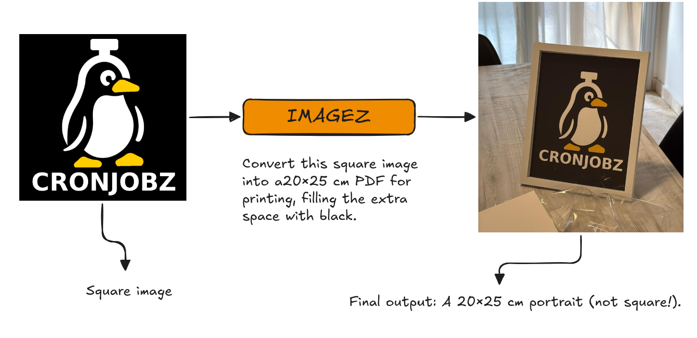

# Imagez

**Imagez** is a simple CLI tool to prepare images for printing, especially useful if you want to frame a photo or artwork and need it to fit an exact size with custom padding.  

It can resize any input image to the dimensions you choose (in centimeters), add padding in any color, and optionally center it on an A4 sheet (PNG or PDF) ready for printing.

---

## Installation

Using **uv**:

    uv tool install imagez

Using **pipx**:

    pipx install imagez

---

## Usage

    imagez PATH [OPTIONS]

### Arguments
- **path** (required): Input image path.

### Options
- `-w, --width-cm FLOAT` — Target width in cm (default: 20.0)  
- `-h, --height-cm FLOAT` — Target height in cm (default: 25.0)  
- `-p, --padding TEXT` — Padding color (`#RRGGBB` or `R,G,B`, default: `#000000`)  
- `--dpi INTEGER` — Output DPI (default: 300)  
- `--out-dir TEXT` — Output directory (default: current folder)  
- `-m, --mode TEXT` — Output mode:  
  - `todo` → all outputs (default)  
  - `pdf` → only A4 PDF with the image centered  
  - `image` → only the target-sized image with padding  
  - `image_a4` → only the A4 PNG with the image centered  

### Examples

Create a **20×25 cm image** with black padding and also an A4 PDF:

    imagez myphoto.jpg -w 20 -h 25 -p "#000000" -m todo

Generate only the **A4 PDF** with the image centered:

    imagez myphoto.jpg -w 30 -h 40 -p "255,255,255" -m pdf

Export only the padded image (no A4):

    imagez myphoto.jpg -w 20 -h 20 -p "#ff0000" -m image

---

## Completion

You can enable shell autocompletion:

    imagez install-completion
    source ~/.bashrc

---

## Why?

When printing photos for frames or decorative purposes, it’s often necessary to:  
- Match a specific size in centimeters.  
- Ensure consistent DPI (e.g. 300 for print).  
- Add padding to make the image fit perfectly without cropping.  
- Place the image centered on an A4 sheet, ready to print.  

Imagez automates all of this with a single command.
